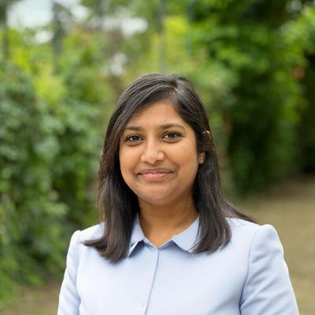

# About

  

####**Bhargavi Munukuntla**

Welcome to my portfolio website! Here, you can explore my work in [autonomous vehicles](#) and [control systems](#).

## Skills

**Technical Skills**

  MATLAB
  Simulink
  SIL
  MIL
  Python
  C
  LaTeX
  Ubuntu

### Achievements

- **Erasmus Mundus Consortium Scholarship Recipient** for Erasmus Mundus Joint Master Degree (EMJMD) program
- Shortlisted for 2nd Erasmus Mundus Association International Poster Competition
- **Erasmus+ scholarship** (€1000)
- Ranked **Top 5%** in Bachelor’s program         
- Ranked **Top 2%** in High School

### Leadership and Guidance
**Coordinator, IEEE Conference** 
*S R Engineering College*

- Guided and engaged sophomore students in IEEE conferences, facilitating their participation and learning.  
- Coordinated logistics and communication between students and conference organizers.

**Head, Model United Nations (MUN) Conference Campaigns**
*S R Engineering College*

- Led campus-wide campaigns to promote MUN participation,increasing student engagement by 35%
- Organized workshops and briefings to prepare participants for conference debates and diplomacy exercises.
- Developed training materials on diplomatic protocol, resolution drafting, and persuasive public speaking
- Established connections with regional MUN networks to enhance institutional participation
  

### Experience

- **Research Intern**
LAMIH UMR CNRS 8201, Valenciennes, France
(The Transport and Human Mobility Laboratory)-Feb 2023 to Jul 2023
Developed obstacle detection algorithm with LIDAR data to
detect obstacles and generate trajectories, aiding
autonomous vehicle navigation while avoiding collisions
The propsed algorithms are developed in the MATLAB/
Simulink environment

- **Intern**
K S Electrical and Engineering Services, Hyderabad, India-Dec 2019 to Feb 2020
Increased induction motor efficiency using advanced
measuring equipment for motor precision balancing.
Decreased repair costs by thorough AC/DC motor testing
resolving overheating and performance issues.

- **Trainee Engineer**
Hyderabad Institute of Electrical Engineers (HIEE), Hyderabad,India-Jun 2019 to Nov 2019
Inspected and tested Solar PV power plant components in
compliance with safety standards.
Assisted apprentices in installing electrical software.

### EDUCATION

**Master of Control and Robotics**
Ecole Centrale de Nantes, Nantes, France
Sept 2021 to Aug 2023
Erasmus Mundus Joint Master degree program
Specialization: Electric Vehicle Propulsion and Control (E-PiCo)

**Master of Computers and Systems Engineering**
Università Degli Studi Dell ‘Aquila, L’Aquila, Italy
Feb 2022 to Jul 2022
Erasmus Mundus Joint Master degree program

**B.Tech Electrical & Electronics Engineering**
SR Engineering College, Warangal, India
Sept 2015 to Jul 2019
Top 5% of the batch